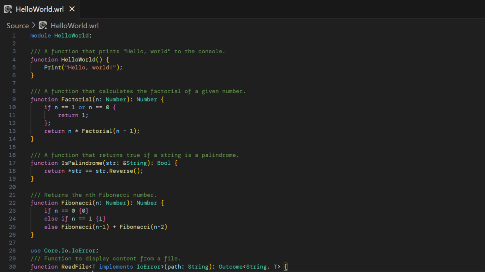

# Whirlwind for VS Code.

This is the official extension for the Whirlwind Programming Language, which provides syntax and semantic highlighting, as well as rich intellisense in Whirlwind files and projects.

# Setup

The extension requires at least VSCode v1.52.0. It also requires the Whirlwind Core Library to be installed for it to work properly.

For steps on installing Whirlwind, visit [here](https://whirlwind-lang.vercel.app).

# Features

-  Code completion
-  Goto Definition
-  Workspace Diagnostics and Messages
-  Find All References
-  Types and Documentation on Hover

---

    
    

